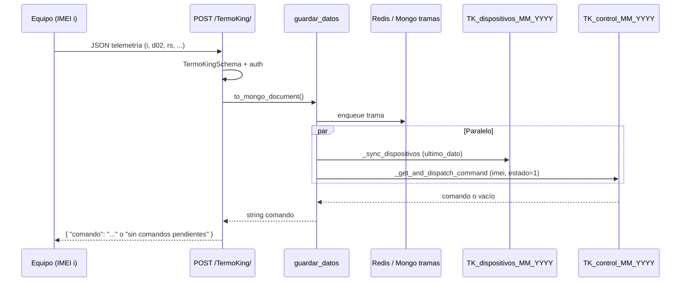

# Recepción de telemetría TermoKing y despacho de comandos

Análisis del flujo desde el **JSON POST** del equipo hasta la **respuesta con comando** (si existe uno pendiente). Aplica igual a **Túnel** y **Starcool** con otro `tipo_dispositivo` y prefijo de colección.

---

## 1. Punto de entrada HTTP

| Elemento | Valor |
|----------|--------|
| Ruta | `POST /TermoKing/` |
| Archivo ruta | `app/routes/termoking.py` |
| Body | JSON validado con `TermoKingSchema` |
| Auth | `make_progressive_auth(TermoKingSchema, "TermoKing")` — legacy sin API key o con `X-Device-Key` |

```python
# app/routes/termoking.py
async def add_data(datos: TermoKingSchema, device: DeviceAuthResult):
    return await handle_telemetry_post(datos, device, "TermoKing")
```

La ruta **no llama directamente** a `Guardar_Datos` de `termoking.py`; usa el handler compartido `handle_telemetry_post` (`app/routes/telemetry_ingest.py`), que a su vez invoca `guardar_datos()`.

---

## 2. Wrapper en termoking.py (líneas 61–66)

```python
async def Guardar_Datos(ztrack_data: dict, secured: bool = False) -> str:
    return await guardar_datos(ztrack_data, secured=secured, tipo_dispositivo="TermoKing")
```

| Rol | Descripción |
|-----|-------------|
| Propósito | Punto de entrada legacy / compatibilidad con código que importa `Guardar_Datos` desde `termoking` |
| Entrada | `ztrack_data`: dict ya normalizado (campo `i` = IMEI, canales, `fecha`, etc.) |
| Salida | **String** con el comando a enviar al equipo, o `"sin comandos pendientes"` |
| Delegación | Toda la lógica está en `app/functions/guardar_datos.py` |

En el flujo actual del POST, el equivalente es:

`TermoKingSchema` → `to_mongo_document()` → `guardar_datos(doc, secured, "TermoKing")`.

---

## 2b. Wrapper en tunel.py (Túnel)

| Elemento | Valor |
|----------|--------|
| Ruta | `POST /Tunel/` |
| Archivo ruta | `app/routes/tunel.py` |
| Schema | `TunelSchema` |
| Colecciones | `TUNEL_{imei}_{MM}_{YYYY}`, `TUNEL_control_{MM}_{YYYY}`, `TUNEL_dispositivos_{MM}_{YYYY}` |

```python
# app/routes/tunel.py
async def add_data(datos: TunelSchema, device: DeviceAuthResult):
    return await handle_telemetry_post(datos, device, "Tunel")

# app/functions/tunel.py
async def Guardar_Datos(ztrack_data: dict, secured: bool = False) -> str:
    return await guardar_datos(ztrack_data, secured=secured, tipo_dispositivo="Tunel")
```

La lógica de **persistencia**, **sync dispositivo** y **despacho de comando** es la **misma** que TermoKing (`guardar_datos.py`), cambiando solo el `tipo_dispositivo`:

| Paso | TermoKing | Túnel |
|------|-----------|-------|
| Tramas | `TK_{imei}_MM_YYYY` | `TUNEL_{imei}_MM_YYYY` |
| Control | `TK_control_MM_YYYY` | `TUNEL_control_MM_YYYY` |
| Dispositivos | `TK_dispositivos_MM_YYYY` | `TUNEL_dispositivos_MM_YYYY` |
| Encolar comando | `POST /TermoKing/comando/` | `POST /Tunel/comando/` |

**Estados de comando (igual en ambos):** `1` pendiente → se envía una vez; `0` ejecutado; `3` cancelado (no se envía).

---

## 3. JSON recibido del equipo

### 3.1 Campos principales (`TermoKingSchema`)

| Campo | Obligatorio | Uso |
|-------|-------------|-----|
| `i` | Sí | IMEI / identificador del chip (15 dígitos o formato compuesto `UNIT222,ZGRU9999994`) |
| `ip` | No | IP de origen (puede venir `10.0.0.1,17,0`; se usa solo la primera parte) |
| `d00`…`d08`, `d1`…`d4` | No | Canales de telemetría (hex, CSV o texto) |
| `gps`, `val`, `rs`, `r` | No | GPS, valores, canal RS, respuesta de comandos previos |
| `estado` | No | Estado de la **trama** (no confundir con `estado` del comando en `TK_control_*`) |
| `c` | No | Canal adicional |

Campos extra en el JSON se aceptan (`extra: allow`).

### 3.2 Transformación a documento Mongo

`TermoKingSchema.to_mongo_document(received_at, secured)`:

- `fecha` ← `server_now()` (GMT-5 / `APP_TIMEZONE`, etiquetado `+00:00`)
- `received_at` ← igual que `fecha`
- `estado` ← `1` (trama válida)
- `secured` ← resultado de autenticación progresiva

Ejemplo simplificado de documento interno:

```json
{
  "i": "868428044554560",
  "ip": "10.81.213.33,17,0",
  "d02": "8.6,9.1,10.0",
  "rs": "RIPENER:0,20.0&",
  "fecha": "2026-07-21T19:00:00+00:00",
  "received_at": "2026-07-21T19:00:00+00:00",
  "estado": 1,
  "secured": false,
  "tipo_dispositivo": "TermoKing"
}
```

---

## 4. Flujo de `guardar_datos()` (núcleo)

Archivo: `app/functions/guardar_datos.py`

```
POST JSON
    │
    ▼
handle_telemetry_post()
    │  to_mongo_document()
    ▼
guardar_datos(ztrack_data, secured, tipo_dispositivo)
    │
    ├─► [A] register_imei_tipo (Redis SET por tipo)
    │
    ├─► [B] Persistir trama
    │       ├─ Redis enqueue (normal)
    │       └─ insert_trama_direct (fallback si Redis cae)
    │           → TK_{imei}_{MM}_{YYYY}
    │
    └─► [C] asyncio.gather (en paralelo)
            ├─ _sync_dispositivos()
            └─ _get_and_dispatch_command()  ← consulta comando
                    │
                    ▼
            return comando (string)
                    │
                    ▼
handle_telemetry_post → respuesta JSON: { "comando": "..." }
```

### 4.1 Validación inicial

```python
imei = ztrack_data.get("i", "")
if not imei:
    return "sin comandos pendientes"
```

Sin IMEI no se persiste ni se buscan comandos.

### 4.2 Persistencia de la trama ([B])

1. **Redis** (`redis_service.enqueue`): cola para el worker `batch_writer`, que escribe en lote en `TK_{imei}_{MM}_{YYYY}`.
2. **Fallback Mongo** (`insert_trama_direct`): si Redis falla, `insert_one` directo en la colección del mes según `received_at` y `_mes_anio()` (GMT-5).

El nombre de colección lo define `bd_gene(imei, "TermoKing", received_at)` → p. ej. `TK_868428044554560_07_2026`.

### 4.3 Sincronización de dispositivo ([C] — `_sync_dispositivos`)

Colección mensual: **`TK_dispositivos_{MM}_{YYYY}`** (mes según `server_now()`).

| Situación | Acción |
|-----------|--------|
| IMEI ya existe (`estado: 1`) | Actualiza `ultimo_dato`, `last_ip`, opcionalmente `secured` |
| IMEI nuevo en el mes | `insert_one` + índices en `TK_{imei}_{MM}_{YYYY}` + métrica `DEVICE_AUTO_REGISTERED` |
| Siempre (best effort) | Registro en catálogo dashboard (`registrar_equipo_por_ingesta`) |

---

## 5. Consulta y envío de comando al equipo

Esta es la parte que responde a: *“¿existe comando para el IMEI que acaba de comunicarse?”*

Función: **`_get_and_dispatch_command(imei, tipo)`**

### 5.1 Colección de comandos

| Tipo | Colección |
|------|-----------|
| TermoKing | `TK_control_{MM}_{YYYY}` |
| Túnel | `TUNEL_control_{MM}_{YYYY}` |
| Starcool | `S_control_{MM}_{YYYY}` |

El mes/año se calcula con **`server_now()` (GMT-5)**, no con el reloj UTC del contenedor (`_mes_anio` en `mongodb.py`).

En cambio de mes se consultan **dos colecciones**, en orden:

1. Mes actual (GMT-5)
2. Mes anterior (por si el comando se insertó el último día del mes anterior)

### 5.2 Criterio de búsqueda

```python
find_one_and_update(
    {"imei": imei, "estado": 1},
    {
        "$set": {
            "estado": 0,
            "status": 2,
            "fecha_ejecucion": now,
        },
    },
    return_document=BEFORE,
)
```

| Campo en `TK_control_*` | Significado |
|---------------------------|-------------|
| `imei` | Mismo valor que `i` del POST |
| `comando` | Texto que recibe el equipo (ej. `PANTALLA:NITRO1*`, `Trama_Readout(3)`) |
| `estado` | **`1`** = pendiente de envío · **`0`** = ya despachado · **`3`** = **cancelado** (no se envía) |
| `status` | `1` = en cola, `2` = entregado al dispositivo en un POST |
| `fecha_creacion` | Cuándo se encoló el comando (`insertar_comando`) |
| `fecha_ejecucion` | Cuándo se despachó en un POST |

**Operación atómica:** `find_one_and_update` evita que dos workers entreguen el mismo comando a la vez.

**Importante:** solo se consideran filas con **`estado: 1`**. Los registros con **`estado: 3`** (cancelados) **no** entran en la consulta y **nunca** se reenvían al equipo.

### 5.3 Resultado devuelto al equipo

| Resultado de la consulta | String retornado | Respuesta HTTP |
|-------------------------|------------------|----------------|
| Hay comando con `estado: 1` | Valor del campo `comando` | `{ "comando": "PANTALLA:..." }` |
| No hay filas pendientes para ese IMEI | `"sin comandos pendientes"` | `{ "comando": "sin comandos pendientes" }` |
| Solo hay comandos cancelados (`estado: 3`) | `"sin comandos pendientes"` | Igual |
| Error Mongo | `"sin comandos pendientes"` | Igual (fail-safe) |

El equipo debe interpretar la respuesta JSON y actuar sobre el campo **`comando`**.

### 5.4 Semántica de `estado` en comandos (no confundir con la trama)

| `estado` | Significado | Despacho |
|----------|-------------|----------|
| **`1`** | Pendiente — válido para enviar | Sí: pasa a `0`, `status: 2`, se devuelve `comando` |
| **`0`** | Ya despachado / consumido | No |
| **`3`** | **Cancelado** | **No** — se ignora en la cola |

Al encolar un comando nuevo usar **`estado: 1`**. Para cancelar uno pendiente, actualizar su documento a **`estado: 3`** (no borrarlo, queda en historial).

---

## 6. Cómo se encolan comandos (flujo inverso)

Ruta TermoKing: **`POST /TermoKing/comando/`** → `insertar_comando()` en `termoking.py`  
Ruta Túnel: **`POST /Tunel/comando/`** → `insertar_comando()` en `tunel.py`

Ambas usan `preparar_comando_para_insert()` y colección `*_control_MM_YYYY` del mes GMT-5.

```python
control_col = get_control_collection("TermoKing")  # TK_control_MM_YYYY del mes GMT-5
datos["fecha_creacion"] = server_now()
datos["fecha_ejecucion"] = None
await control_col.insert_one(datos)
```

Body típico (`ComandoSchema`):

```json
{
  "imei": "868428044554560",
  "comando": "PANTALLA:OBJ_CO2_Z1:8*",
  "estado": 1,
  "status": 1,
  "user": "panel",
  "evento": "Ajuste objetivo"
}
```

El comando **no se envía al instante**: queda en `TK_control_*` hasta el **próximo POST de telemetría** del mismo IMEI, cuando `_get_and_dispatch_command` lo lee y lo devuelve en la respuesta.

---

## 7. Diagrama secuencial (equipo ↔ servidor)



---

## 8. Zona horaria y colecciones mensuales

| Concepto | Implementación |
|----------|----------------|
| Reloj de negocio | `server_now()` → `APP_TIMEZONE` (ej. `America/Lima`, GMT-5) |
| Tramas | `TK_{imei}_{MM}_{YYYY}` según `received_at` |
| Control / dispositivos | `TK_control_{MM}_{YYYY}`, `TK_dispositivos_{MM}_{YYYY}` según `server_now()` |
| Regla | `_mes_anio()` **no** usa `datetime.now()` del SO (UTC en Docker) |

Si insert y despacho usan el mismo criterio GMT-5, comando y telemetría caen en el **mismo mes** salvo el cruce de mes (mitigado buscando también el mes anterior al despachar).

---

## 9. Archivos implicados (referencia rápida)

| Archivo | Función |
|---------|---------|
| `app/routes/termoking.py` | Ruta POST `/`, delega a `handle_telemetry_post` |
| `app/routes/telemetry_ingest.py` | Métricas + `guardar_datos` + respuesta `{ comando }` |
| `app/functions/termoking.py` | `Guardar_Datos` (wrapper), `insertar_comando` |
| `app/functions/guardar_datos.py` | Persistencia, sync dispositivo, **despacho comando** |
| `app/models/termoking.py` | Validación JSON → documento Mongo |
| `app/models/common.py` | `ComandoSchema` para encolar comandos |
| `app/database/mongodb.py` | `bd_gene`, `get_control_collection`, `_mes_anio` |
| `app/workers/batch_writer.py` | Redis → `TK_{imei}_{MM}_{YYYY}` en lote |
| `app/functions/persist_trama.py` | Fallback directo a Mongo |

---

## 10. Resumen en una frase

El equipo envía **JSON** a `POST /TermoKing/`; el servidor **guarda la trama**, **actualiza el registro del dispositivo** y **busca en `TK_control_{mes}`** un documento con su `imei` y **`estado: 1`** (pendiente); si existe, lo marca **`estado: 0`**, `status: 2` y **devuelve el texto del campo `comando`**. Los comandos con **`estado: 3`** (cancelados) no se envían.
